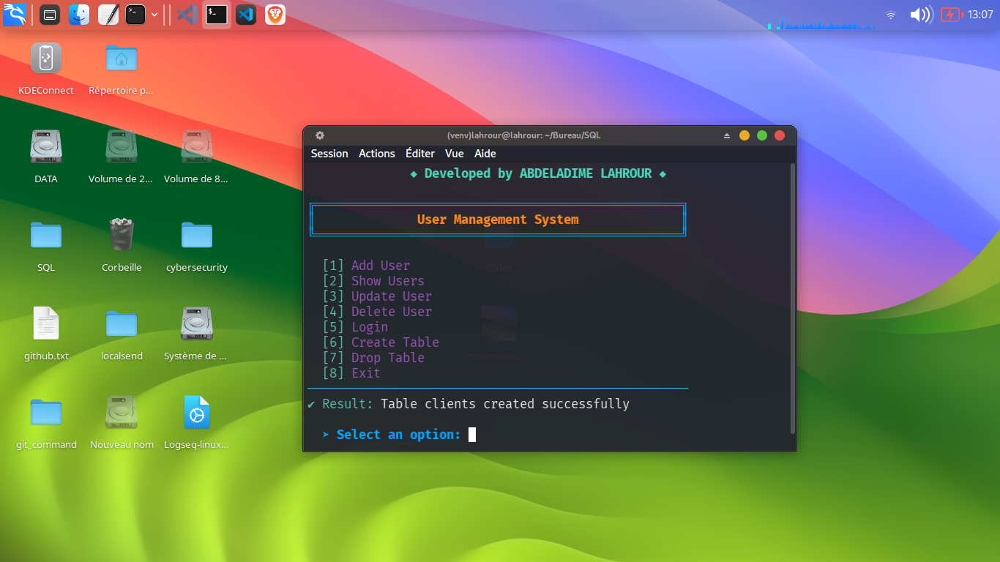

# 🔥 Gestion de Base de Données

## 📌 Aperçu
Ce projet contient des utilitaires en ligne de commande pour la gestion de bases de données SQL.

## ✨ Fonctionnalités
- Configuration du schéma de la base de données
- Requêtes avancées
- Scripts de manipulation de données
- Interface utilisateur interactive

## 🚀 Pour commencer

### Installation
1. Clonez ou téléchargez les fichiers du projet
```bash
git clone https://github.com/lahrour88/database_managment.git
```

2. Configurez l'environnement virtuel

```bash
python3 -m venv venv
source venv/bin/activate
pip install -r requirements.txt
```

📖 Utilisation

1. Lancez l'interface SQL

```bash
python main.py
```

2. Menu principal
   

📁 Structure du projet

```
┌──(venv)─(lahrour㉿lahrour)-[~/Bureau/SQL]
└─$ tree -L 2
.
├── database
│   ├── database.py
│   └── user_repository.py
├── data.db
├── documentation_SQL.md
├── main.py
├── models
│   └── user.py
├── picter
│   └── menu.png
├── README.md
├── services
│   └── auth_service.py
└── utils
    └── validator.py
+
6 directories, 10 fichiers
┌──(venv)─(lahrour㉿lahrour)-[~/Bureau/SQL]
└─$
```

🤝 Contribution

N'hésitez pas à modifier et étendre les scripts selon vos besoins.

---

📜 Licence & Crédits

© 2026 Lahrour - Tous droits réservés

Ce projet est sous licence MIT - voir le fichier LICENSE pour plus de détails.

---

👨‍💻 Développeur

Lahrour Abdeladime

· 🐙 GitHub : @lahrour88
· 📷 Instagram : [@lahrour_1902](instagram.com/lahrour_1902)